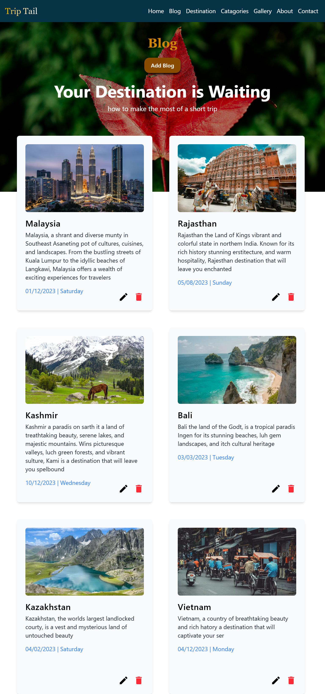

# 🌍 Travel Blog

***(Work in Progress)***

A modern and visually appealing travel blog built with **React** and **Vite**, showcasing beautiful destinations using a clean card-based UI. This project demonstrates component-based architecture, reusable UI elements, and responsive design.

---

## ✨ Features

* 🧭 **Interactive Navbar**
* 🗺️ **Dynamic Travel Cards** (fetched from a local data file)
* 📱 **Responsive Design** for all devices
* ⚡ **Vite-powered** fast development environment
* 🧩 **Reusable Components** (Navbar, Card)
* 🎨 **Clean UI** layout suitable for blogs or portfolios

---

## 📸 Screenshots

**Large Monitor**


**Laptop**


**Tablet**



**Mobile**


---

## 📂 Project Structure

```
travel_blog/
│── .gitignore
│── eslint.config.js
│── index.html
│── package.json
│── package-lock.json
│── README.md
│── vite.config.js
│
├── public/
│   └── vite.svg
│
├── src/
│   ├── App.jsx
│   ├── index.css
│   ├── main.jsx
│   │
│   ├── assets/
│   │   └── react.svg
│   │
│   ├── components/
│   │   ├── Card.jsx
│   │   └── Navbar.jsx
│   │
│   ├── data/
│   │   └── data.jsx
│   │
│   └── images/
│       └── background_image.jpg
```

---

## 🛠️ Tech Stack

**Frontend:**

* React
* JSX Components
* CSS

**Build Tools:**

* Vite
* ESLint

---

## 🚀 Getting Started

Follow these instructions to run the project locally.

### 1️⃣ Clone the repository

```bash
git clone https://github.com/aljuSabu/travel-blog.git
cd travel-blog
```

### 2️⃣ Install dependencies

```bash
npm install
```

### 3️⃣ Start the development server

```bash
npm run dev
```

The app will be available at:

```
http://localhost:5173
```

---

## 🧱 Components Overview

### **Navbar.jsx**

A simple and reusable navigation bar for branding or navigation links.

### **Card.jsx**

Displays travel location info including image, title, description, and link.

### **data.jsx**

Contains an array of travel destination objects used to generate cards dynamically.

---

## 📦 Build for production

```bash
npm run build
```

---

## 🔧 ESLint

To maintain code quality:

```bash
npm run lint
```

---

## 🙌 Contributing

Contributions are welcome!
Feel free to open issues or submit pull requests.

---

## 📄 License

This project is **open-source** — add your preferred license (MIT recommended).

---
